## 生成 IP

1.  创建 Vivado 工程
File -> Project -> New
Project Type：RTL Project
选你的 FPGA Part/Board（IP 会与器件绑定）
勾选/不勾选 “Do not specify sources at this time” 都行
2.  添加源文件
    - Design Sources（设计源）
        把 src/core/ 下所有 .v 加入（建议全加，避免缺依赖）
    - Simulation Sources（仿真源）加入：
        ```
        src/test/test_divider.v
        src/test/test_multiplier.v
        src/test/test_core.v
        src/test/tool_bram_cache.v
        ```
3) 添加 IP（从 .xci 导入）
Add Sources -> Add or Create IP
把下列 .xci 加进来（至少前两个是必须的）：

        ```
        ip/ip_divider/ip_divider.xci
        ip/ip_multiplier/ip_multiplier.xci
        ip/ip_bram/ip_bram.xci
        ip/ip_vram/ip_vram.xci
        ip/ip_clock_div/ip_clock_div.xci
        ```

4) 生成 IP 输出产物（Generate Output Products）：
对每个 IP，在 Sources 面板里找到 IP, 右键 .xci 文件：Upgrade IP（如果提示需要升级），之后Generate Output Products。注意multiplier与divider的IP一般在core_top下面的multiplier与divider的下一个层级。

## 运行仿真：test_divider / test_multiplier / test_core

### 除法测试
1. 操作：在 Sources -> Simulation Sources 里右键 test_divider.v，选择Set as Top

    如果需要修改运行时间（视测试而定，vivado默认为1000ns），点击左侧 Flow Navigator → Simulation → Simulation Settings
    或者点击菜单栏 Tools → Settings → Simulation，在 Simulation 选项卡中找到 xsim.simulate.runtime，将默认值从 1000ns 改为你需要的时间，点击 Apply 和 OK。

    之后选择Flow Navigator -> Run Simulation -> Run Behavioral Simulation

2. 测试功能:
准备11组测试数据：
包括：
- **普通除法**：`1 ÷ 1`、`0x20241107 ÷ 0x19491001`
- **正负数组合**：正÷负、负÷正、负÷负
- **除零测试**：`0x20241107 ÷ 0`、`-0x20241107 ÷ 0`
- **溢出测试**：`0x80000000 ÷ -1`（最小负数除以-1）

```verilog
localparam DIV_TB_NUM = 11;
reg [31:0] div_rs1_data_arr[DIV_TB_NUM - 1:0];
reg [31:0] div_rs2_data_arr[DIV_TB_NUM - 1:0];
```

之后分别进行DIV和REM测试（有符号除法和取余）以及DIVU和REMU测试（无符号除法和取余）在这11个测试用例上的测试。

**有符号关键验证点**：
- **除法恒等式**：`被除数 = 除数 × 商 + 余数`
- **余数符号**：余数符号与被除数相同
- **除零行为**：商为-1，余数为被除数本身（RISC-V规范）
- **溢出行为**：`-2^31 ÷ -1`商为`-2^31`，余数为0

3. 结果：

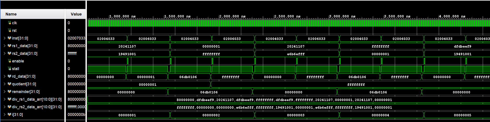

### 乘法测试
1. 操作：同上

2. 测试功能:
验证`core_multiplier`模块的正确性，包括：
- **MUL**：32位乘法（返回低32位）
- **MULH**：32位有符号乘法（返回高32位）
- **MULHSU**：32位有符号×无符号乘法（返回高32位）
- **MULHU**：32位无符号乘法（返回高32位）
准备8组测试数据：
包括：
- **正数×正数**：`1 × 1`、`0x20241107 × 0x19491001`
- **正数×负数**：`1 × -1`、`0x20241107 × -0x19491001`
- **负数×正数**：`-1 × 1`、`-0x20241107 × 0x19491001`
- **负数×负数**：`-1 × -1`、`-0x20241107 × -0x19491001`

3. 结果：

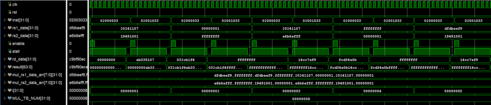

### CPU集成测试
1. 操作：同上

    建议在Wave窗口中添加以下信号组：

    ```
    add_wave_divider "==== 流水线阶段追踪 ===="
    add_wave {{/test_core/uut_core/pipeline_ctrl/if_id_pc_r}}
    add_wave {{/test_core/uut_core/pipeline_ctrl/if_id_inst_r}}
    add_wave {{/test_core/uut_core/pipeline_ctrl/id_ex_pc_r}}
    add_wave {{/test_core/uut_core/pipeline_ctrl/id_ex_inst_r}}
    add_wave {{/test_core/uut_core/pipeline_ctrl/ex_mem_pc_r}}
    add_wave {{/test_core/uut_core/pipeline_ctrl/ex_mem_inst_r}}
    add_wave {{/test_core/uut_core/pipeline_ctrl/mem_wb_pc_r}}
    add_wave {{/test_core/uut_core/pipeline_ctrl/mem_wb_inst_r}}

    add_wave_divider "==== 数据前递追踪 ===="
    # ID/EX阶段寄存器编号
    add_wave {{/test_core/uut_core/pipeline_ctrl/id_ex_rs1_r}}
    add_wave {{/test_core/uut_core/pipeline_ctrl/id_ex_rs2_r}}
    add_wave {{/test_core/uut_core/pipeline_ctrl/id_ex_rd_r}}
    # 原始数据（未前递）
    add_wave {{/test_core/uut_core/pipeline_ctrl/id_ex_rs1_data_r}}
    add_wave {{/test_core/uut_core/pipeline_ctrl/id_ex_rs2_data_r}}
    # 前递后数据
    add_wave {{/test_core/uut_core/pipeline_ctrl/ex_rs1_data_w}}
    add_wave {{/test_core/uut_core/pipeline_ctrl/ex_rs2_data_w}}
    # 前递源（EX/MEM和MEM/WB）
    add_wave {{/test_core/uut_core/pipeline_ctrl/ex_mem_rd_r}}
    add_wave {{/test_core/uut_core/pipeline_ctrl/ex_mem_rd_valid_r}}
    add_wave {{/test_core/uut_core/pipeline_ctrl/ex_mem_ex_result_r}}
    add_wave {{/test_core/uut_core/pipeline_ctrl/mem_wb_rd_r}}
    add_wave {{/test_core/uut_core/pipeline_ctrl/mem_wb_rd_value_r}}

    add_wave_divider "==== 冒险检测与暂停 ===="
    add_wave {{/test_core/uut_core/pipeline_ctrl/data_harzard_w}}
    add_wave {{/test_core/uut_core/pipeline_ctrl/control_harzard_w}}
    add_wave {{/test_core/uut_core/pipeline_ctrl/control_harzard_r}}
    add_wave {{/test_core/uut_core/pipeline_ctrl/stall_w}}
    add_wave {{/test_core/uut_core/pipeline_ctrl/if_enable_r}}
    add_wave {{/test_core/uut_core/fetch/stall_o}}
    add_wave {{/test_core/uut_core/lsu/stall_o}}
    add_wave {{/test_core/uut_core/multiplier/stall_o}}
    add_wave {{/test_core/uut_core/divider/stall_o}}

    add_wave_divider "==== 分支跳转 ===="
    add_wave {{/test_core/uut_core/exec/pc_take_branch_o}}
    add_wave {{/test_core/uut_core/exec/pc_branch_o}}
    add_wave {{/test_core/uut_core/pipeline_ctrl/ex_mem_pc_take_branch_r}}
    add_wave {{/test_core/uut_core/pipeline_ctrl/ex_mem_pc_branch_r}}
    add_wave {{/test_core/uut_core/fetch/pc_r}}

    add_wave_divider "==== 寄存器文件（验证指令结果）===="
    add_wave -radix decimal {{/test_core/uut_core/regfile/x1_ra_r}}
    add_wave -radix decimal {{/test_core/uut_core/regfile/x2_sp_r}}
    add_wave -radix decimal {{/test_core/uut_core/regfile/x3_gp_r}}
    add_wave -radix decimal {{/test_core/uut_core/regfile/x4_tp_r}}
    add_wave -radix decimal {{/test_core/uut_core/regfile/x5_t0_r}}
    add_wave -radix decimal {{/test_core/uut_core/regfile/x6_t1_r}}
    add_wave -radix decimal {{/test_core/uut_core/regfile/x7_t2_r}}
    ...
    add_wave -radix decimal {{/test_core/uut_core/regfile/x29_t4_r}}
    add_wave -radix decimal {{/test_core/uut_core/regfile/x30_t5_r}}

    add_wave_divider "==== 访存接口 ===="
    add_wave {{/test_core/dcache_enable_w}}
    add_wave {{/test_core/dcache_wr_w}}
    add_wave {{/test_core/dcache_rd_w}}
    add_wave {{/test_core/dcache_addr_w}}
    add_wave {{/test_core/dcache_data_wr_w}}
    add_wave {{/test_core/dcache_data_rd_w}}
    add_wave {{/test_core/dcache_done_w}}

    add_wave_divider "==== 乘除法单元 ===="
    add_wave {{/test_core/uut_core/multiplier/status_r}}
    add_wave {{/test_core/uut_core/divider/status_r}}
    add_wave {{/test_core/uut_core/divider/input_valid_r}}
    add_wave {{/test_core/uut_core/divider/out_valid_w}}

    add_wave_divider "==== CSR ===="
    add_wave {{/test_core/uut_core/csr/mstatus_r}}
    add_wave {{/test_core/uut_core/csr/mtvec_r}}
    add_wave {{/test_core/uut_core/csr/mepc_r}}
    ```

    以上波形配置保存在trq_core_test/test_core_behav.wcfg文件中，也可直接导入Vivado 2024.1中。

2. 测试功能:
验证完整的RISC-V处理器核心（`core_top`）功能：
- 指令取指和执行
- 寄存器读写
- 数据存储器访问
- 流水线控制

    测试程序（全面覆盖RV32IMZicsr），`tool_bram_cache`预加载的测试程序包含**92条指令**，全面覆盖RV32IMZicsr指令集。

3. 结果：
寄存器记录见doc/test_result/core_test_reg.log。


测试波形：


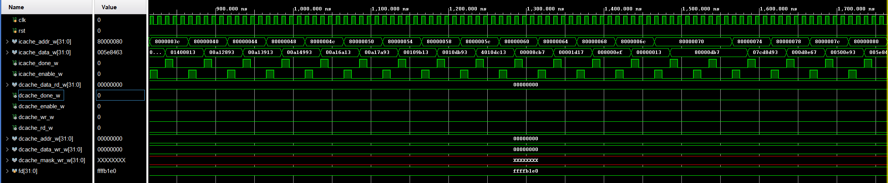

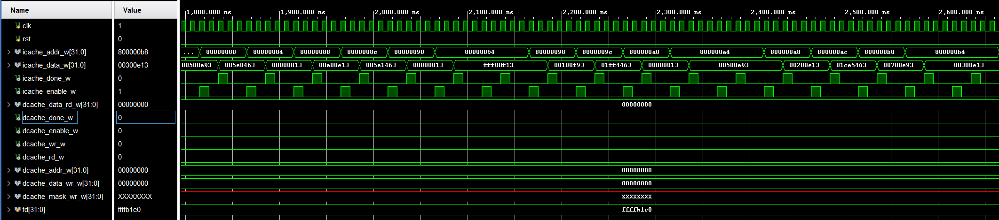

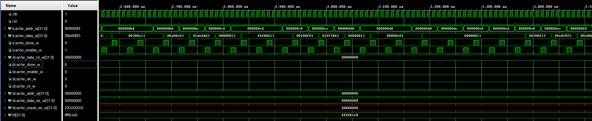

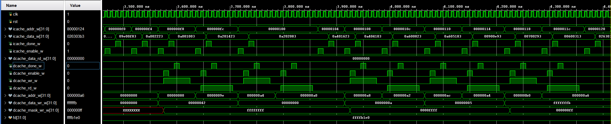

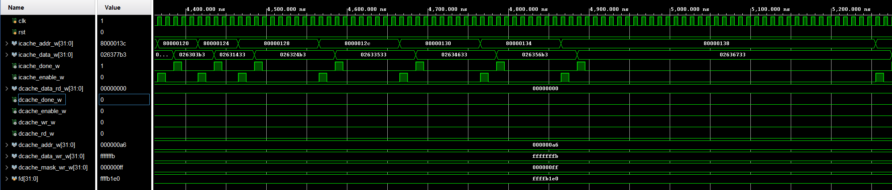

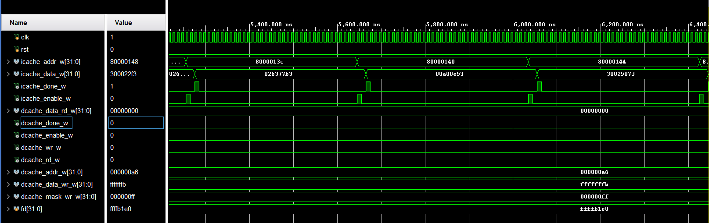

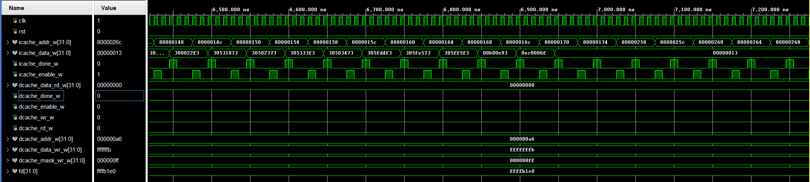

4. 结果解释：

算术指令：
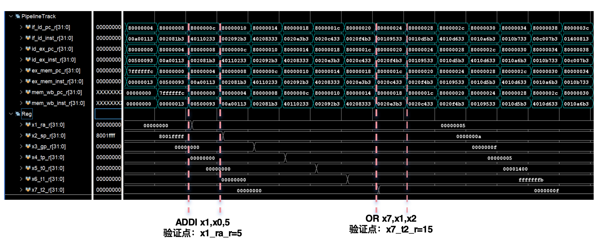

立即数指令：
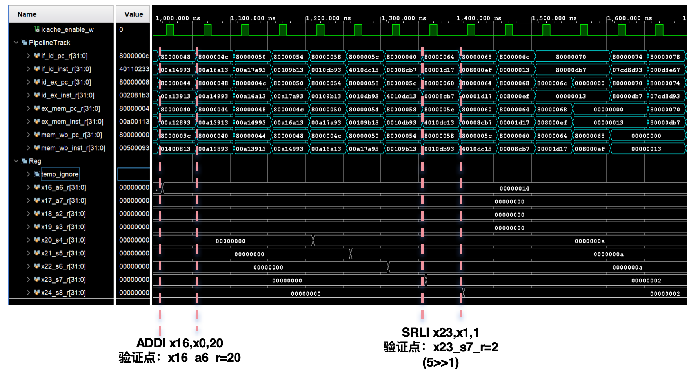

数据前递
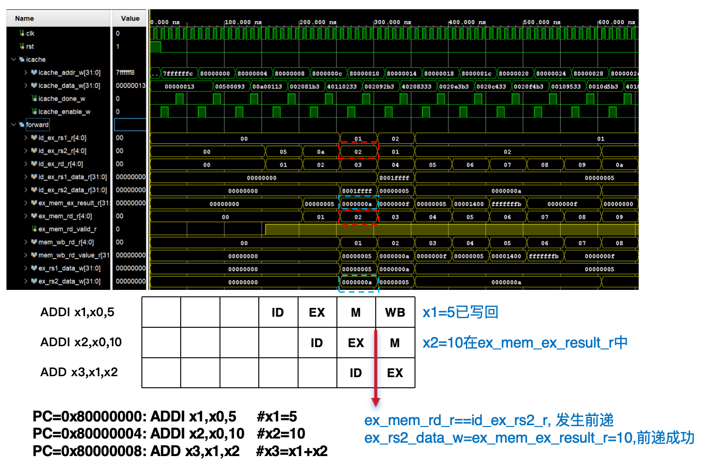

分支
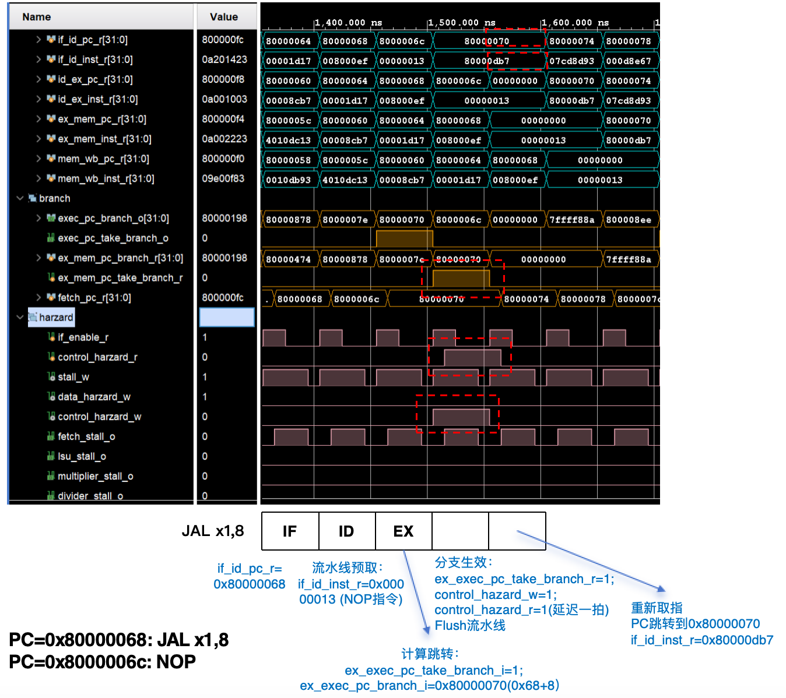

乘法
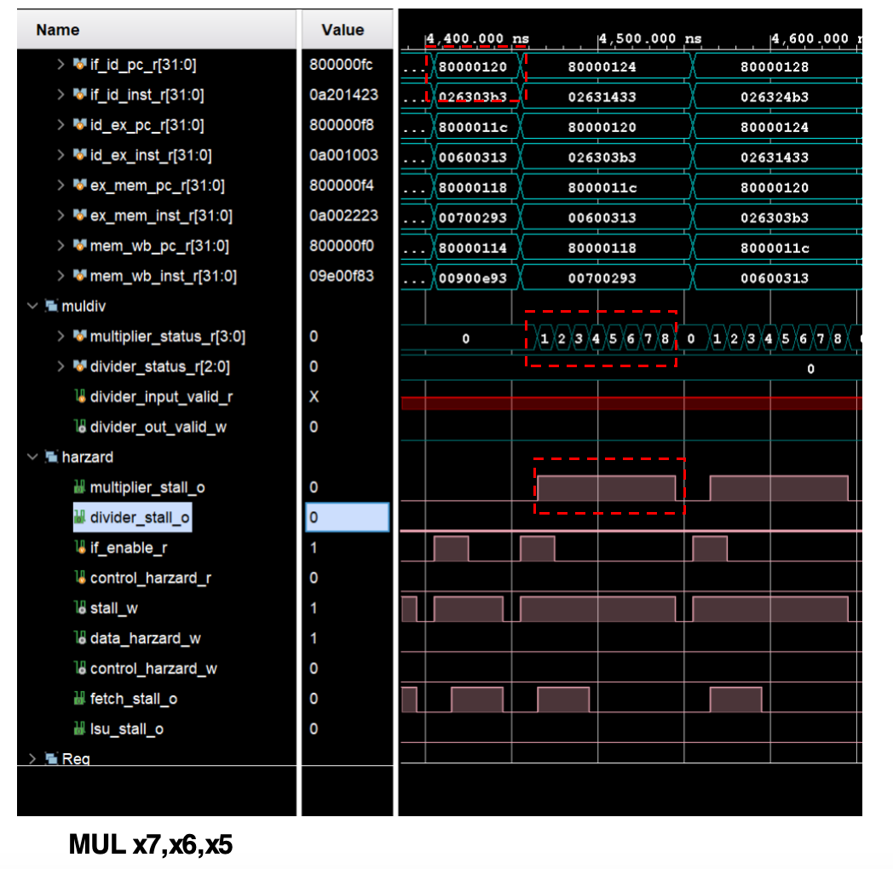

CSR
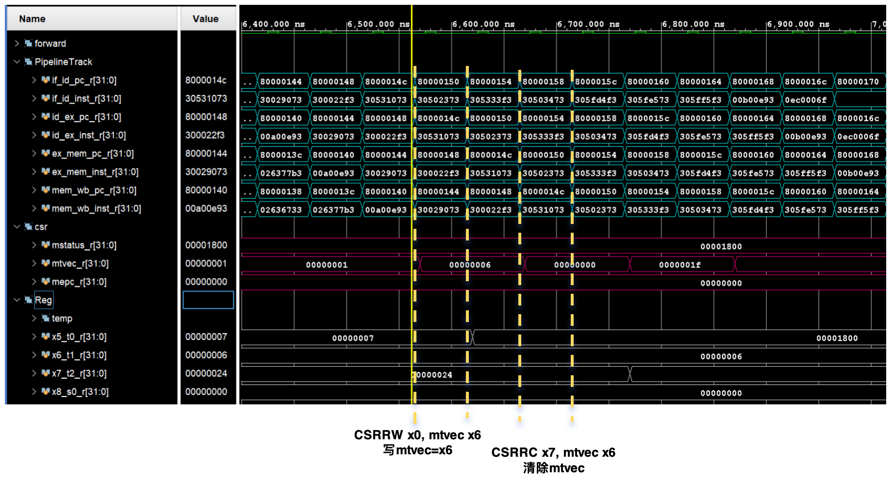


### UART测试

1. 操作：同上

2. 测试功能:
验证UART（通用异步收发器）的基本功能：
- 发送数据（TX）
- 接收数据（RX）
- 环回测试（TX连接到RX）

3. 结果：
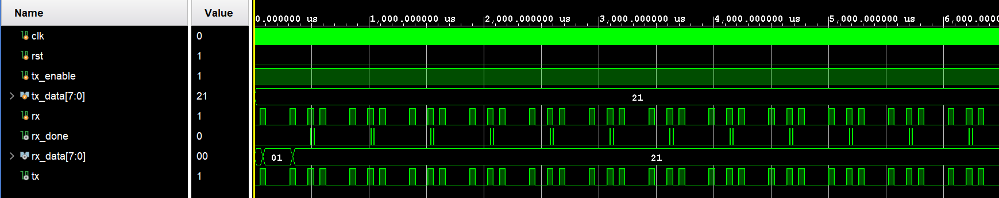


